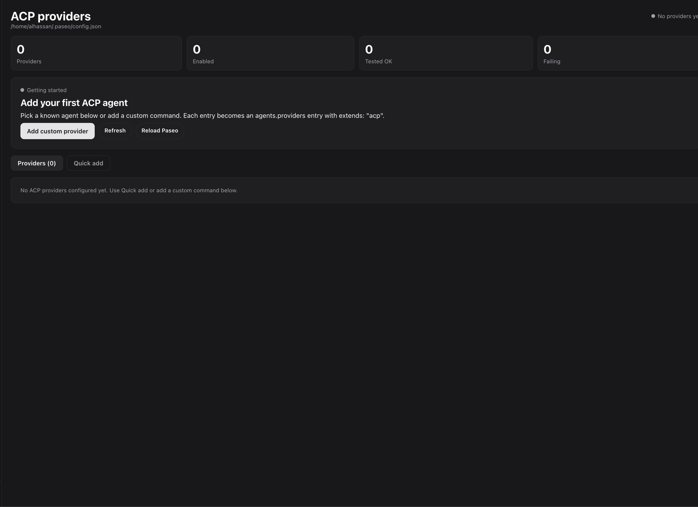
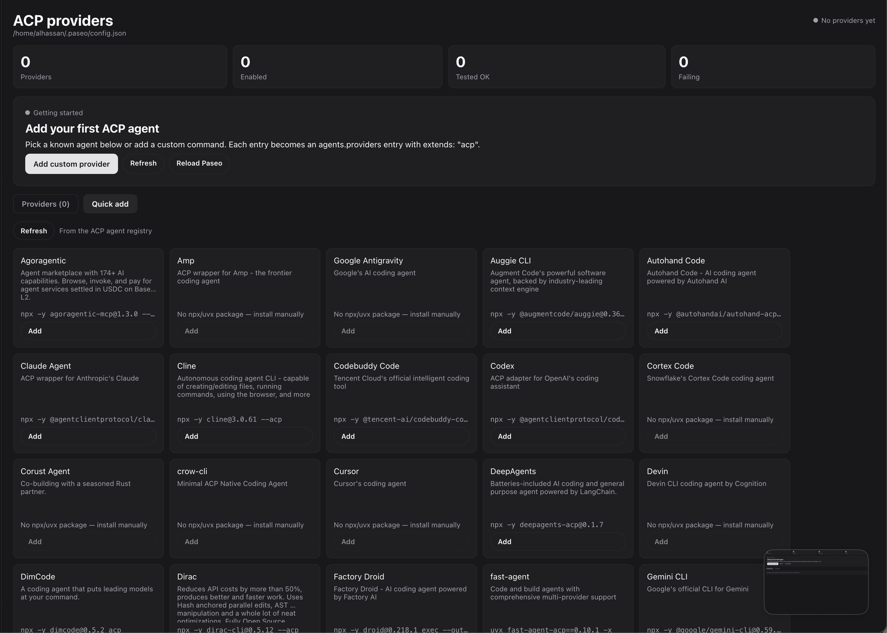

# acp-manager

Sidebar UI for managing official ACP custom providers: `agents.providers` entries with
`extends: "acp"` in `$PASEO_HOME/config.json` (typically `~/.paseo/config.json`).

## Features

- Add, edit, enable/disable, test, and remove ACP providers from one panel.
- **Quick add**: browse agents from the [ACP agent registry](https://agentclientprotocol.com/get-started/registry)
  and add one with a prefilled command/env, no manual `npx`/`uvx` typing.
- **Reload Paseo**: applies saved changes immediately (runs `paseo reload` on the daemon host)
  instead of requiring a separate terminal step.
- Health summary (providers / enabled / tested OK / failing) and a per-provider Test button
  that runs the ACP `initialize` handshake against the configured command.

## Install

```bash
paseo plugin install npm:@alhassanaraouf/paseo-acp-manager
```

Or from GitHub:

```bash
paseo plugin add alhassanaraouf/paseo-acp-manager
```

Then open **ACP Manager** in the sidebar.

## Screenshots

| Overview | Quick add |
| --- | --- |
|  |  |

## Known issues

- Provider creation goes through direct config-file edit (read-modify-write on
  `agents.providers.<id>` only, timestamped `.bak` backup, re-parse before replacing)
  because the SDK `paseo.config.patch` schema does not cover `extends`/`command`/`env` yet.
- "Reload Paseo" shells out to the `paseo` CLI on the daemon host, so it requires `paseo` to be
  on the daemon's `PATH`.
- Quick add only covers registry agents distributed via `npx`/`uvx`; agents shipped only as a
  platform binary are listed but must be installed manually.
- The registry fetch requires outbound network access from the daemon host.
